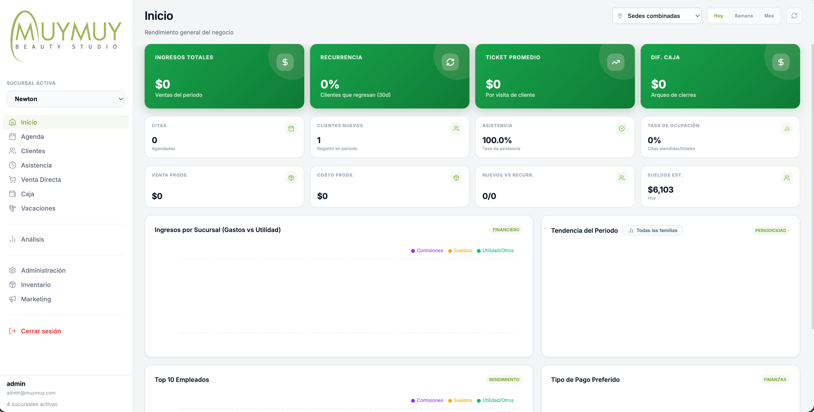
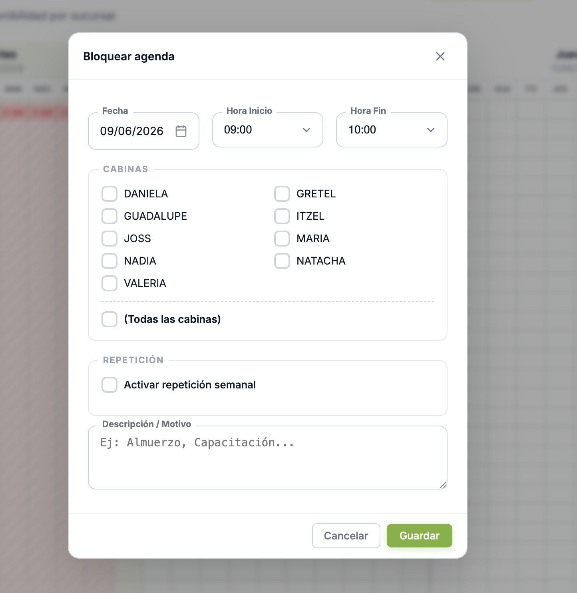
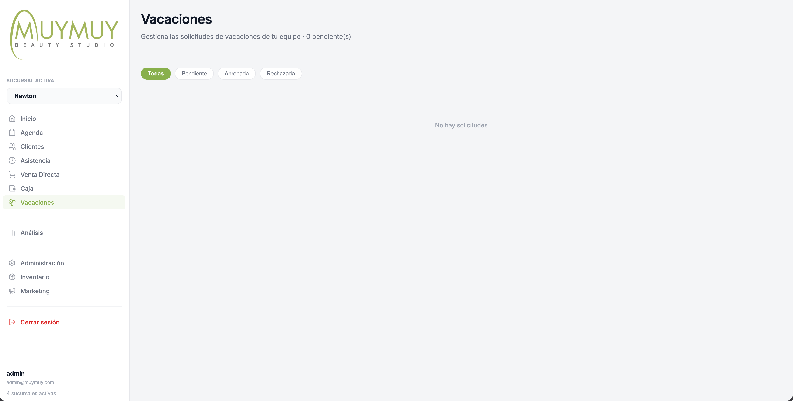
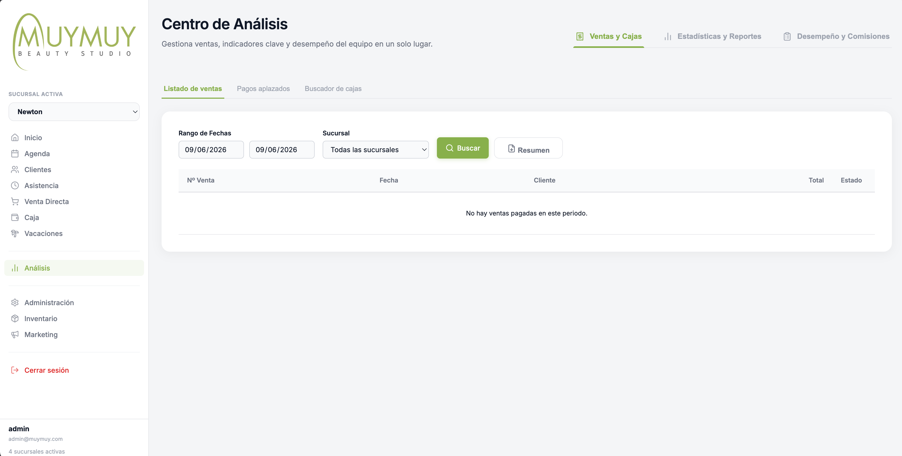
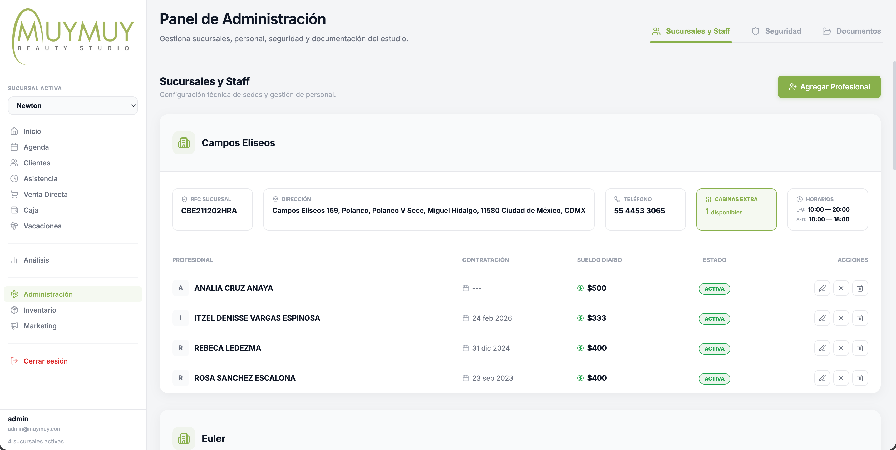
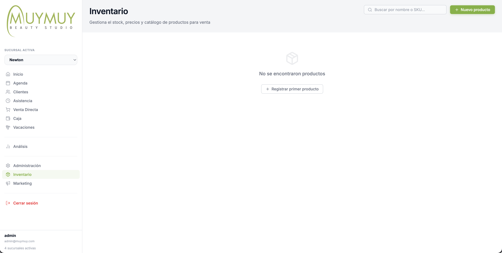
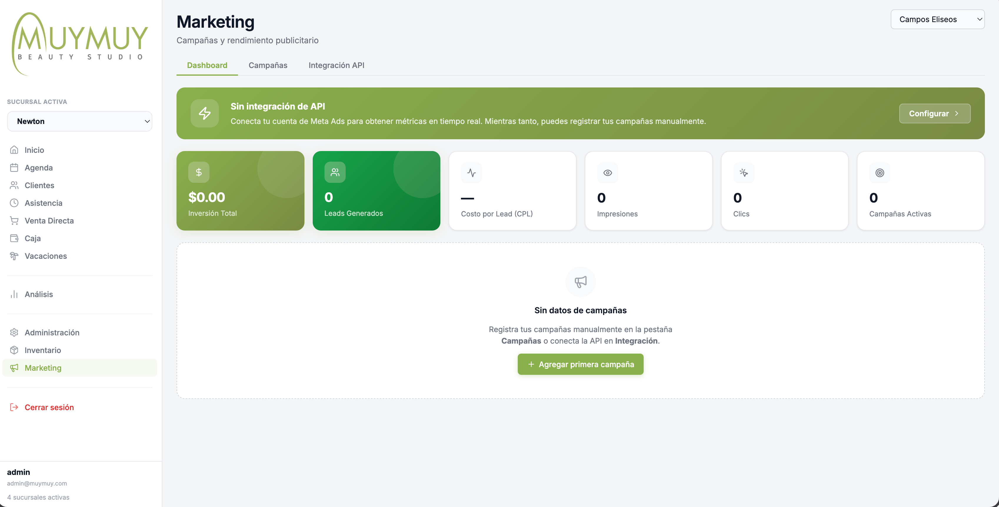

  
  <h1 class="cover-title">Manual de Administración del Sistema</h1>
  
Rol: Administrador / Superadmin

  
Última actualización: Junio 2026

# Introducción para Administradores

Como **Administrador** de **MUYMUY Beauty Studio**, posees privilegios elevados dentro del sistema que te otorgan visibilidad y control sobre todas las operaciones de las sucursales.
A diferencia del rol de Empleado, puedes cambiar de sucursal en tiempo real usando el selector ubicado en el menú lateral o en la cabecera. La información de toda la aplicación se ajustará automáticamente a la sucursal seleccionada.

A continuación, se detalla el funcionamiento de cada módulo, ordenado **exactamente como aparece en el menú lateral**.

---

# 1. Inicio (Dashboard Principal)

El **Dashboard Principal** te permite monitorear el rendimiento general del negocio al instante. Al entrar al sistema, verás métricas clave que resumen la salud financiera y operativa.

Desde esta pantalla puedes:
- **Filtrar por Sucursal y Fecha:** Cambiar entre vistas de "Hoy", "Semana" o "Mes" para todas las sucursales combinadas o una en específico.
- **Visualizar Ingresos y KPI:** Monitorear ingresos totales, ticket promedio, tasa de retención de clientes y diferencias de caja.
- **Gráficos de Tendencias:** Observar cómo se comportan los ingresos y qué servicios son los más solicitados.

---

# 2. Agenda

La agenda es la pantalla principal operativa. 
Como administrador, si necesitas realizar un **Bloqueo Masivo** (cerrar la sucursal por un evento, remodelación o día festivo), puedes presionar el botón "Bloqueo Masivo" en la esquina superior de la agenda, seleccionar las fechas, y el sistema automáticamente bloqueará todas las columnas de la sucursal seleccionada para evitar que se puedan agendar citas.

---

# 3. Clientes

Directorio general de clientes. Puedes exportar la base de datos o revisar historiales completos desde esta sección para futuras estrategias comerciales.

---

# 4. Asistencia

Visualiza los registros de entrada y salida de todo el personal de la sucursal seleccionada. Aquí puedes monitorear quiénes tienen el estatus "S/E" (Sin Entrada) por llegar tarde o ausentarse.

---

# 5. Venta Directa

Módulo operativo (generalmente usado por recepción) para ventas de mostrador de productos sin cita previa. Puedes monitorear las transacciones activas.

---

# 6. Caja

Auditoría en vivo del turno operativo de la caja. Puedes ver a qué hora se abrió el turno, por quién, y qué movimientos (ingresos y gastos) se han registrado.

---

# 7. Vacaciones

Módulo central para la autorización y denegación de solicitudes de vacaciones del personal. Cada vez que una empleada haga una petición, aparecerá aquí con estatus Pendiente.

### Flujo de Aprobación:
1. **Revisar Solicitud:** Verás el nombre de la empleada, las fechas solicitadas, y la cantidad de días hábiles que representan.
2. **Tomar Acción:** Al presionar "Aprobar" o "Rechazar", se abrirá un modal.
3. **Bloqueo Automático:** Si apruebas la solicitud, el sistema **bloqueará automáticamente la agenda** de esa profesional durante esos días, asegurando que nadie pueda agendarle una cita por accidente. Puedes agregar una nota (ej: "Aprobado, disfruta tu viaje") que ella podrá leer.

---

# 8. Análisis (Centro de Análisis)

El **Centro de Análisis** es tu panel financiero y de reportes profundos.

Este centro se divide en tres pestañas principales de trabajo:

## 8.1 Ventas y Cajas
Es la pestaña operativa para auditar transacciones.
- **Listado de Ventas:** Inspeccionar todos los tickets cobrados, buscar por código de ticket o cliente, y exportar resúmenes en CSV.
- **Pagos Aplazados:** Muestra clientes con estatus "Pendiente" de pago.
- **Buscador de Cajas:** Permite realizar auditorías sobre las aperturas y cierres de los cajones de dinero históricos. Si hubo un desfase, se verá resaltado en rojo o verde.

## 8.2 Estadísticas y Reportes
Aquí puedes consultar más de 20 indicadores clave (KPIs) agrupados por: Clientes (nuevos vs recurrentes, procedencia), Servicios (los más vendidos, tiempo promedio), Agenda (Tasa de inasistencias o No-Shows) y Facturación Neta.

## 8.3 Desempeño y Comisiones
La tabla automatizada de cálculo de nómina variable.
El sistema genera el cálculo quincenal o mensual sumando los servicios realizados y aplicando el porcentaje configurado para la empleada. Puedes exportar esta información directamente a Excel para el pago de nómina.

---

# 9. Administración

El Panel de Configuración General, de acceso exclusivo para administradores.

## 9.1 Sucursales y Staff
- **Personal y Perfiles:** Desde la sub-pestaña de Empleadas puedes agregar o desactivar personal, asignarles sucursal, cambiar su rol y configurar su nivel de acceso. **Nota:** Para crear perfiles nuevos puedes hacerlo tú o contactar a IT (David Rizo) si requieres ayuda.
- **Esquemas de Comisión:** Cada empleada puede tener un esquema de comisión diferente y sueldo base. Puedes modificar esto libremente; se aplicará a los próximos servicios que realicen.

## 9.2 Seguridad
Auditoría técnica del sistema para rastrear accesos, creación de perfiles y borrado de información sensible (por si sospechas de alguna actividad inusual).

## 9.3 Documentos
Un repositorio digital para subir manuales, actas o documentos operativos importantes para que estén centralizados.

---

# 10. Inventario

Control total de productos. Puedes visualizar el catálogo, ver el nivel de stock en tiempo real para cada sucursal, e ingresar remisiones para actualizar los niveles de unidades disponibles de cada producto o cabina extra.

---

# 11. Marketing

Módulo para exportación y fidelización. Utiliza el filtro de clientes para extraer listas de contactos que cumplen con ciertos criterios (ej: clientes que no han venido en 3 meses, o que gastan más de $2000) y descárgalos en CSV para cargarlos en tus herramientas de Email Marketing o WhatsApp.

