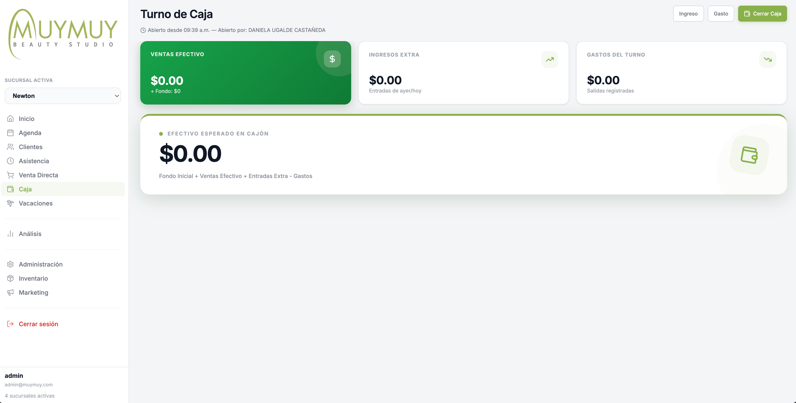

  
  <h1 class="cover-title">Manual de Operación de Sucursal</h1>
  
Rol: Empleado / Recepción y Caja

  
Última actualización: Junio 2026

# 1. Introducción al Sistema

Bienvenida al sistema de gestión de **MUYMUY Beauty Studio**. Este manual práctico te guiará paso a paso en tus tareas diarias para garantizar una operación fluida, un cobro correcto y un control preciso de la asistencia y la caja de tu sucursal.

Como **Empleado**, tu cuenta tiene las siguientes características de seguridad y operación:
- **Restricción de Sucursal:** Tu vista está bloqueada automáticamente a la sucursal a la que estás asignada. No es necesario seleccionar o cambiar de sucursal; el sistema lo gestiona por ti.
- **Acceso Limitado:** Solo verás las pestañas operativas (Agenda, Caja, Asistencia y tu Perfil). Las métricas avanzadas y configuraciones globales quedan reservadas para administración.

---

# 2. Registro de Asistencia

Llevar un registro preciso de las horas de entrada y salida es fundamental para el cálculo correcto de tu nómina y puntualidad.

### Cómo registrar tu entrada y salida:
1. Dirígete al panel de **Asistencia** en el menú lateral.
2. Selecciona tu nombre en la lista de profesionales.
3. Presiona el botón **Registrar Entrada** (al inicio del día) o **Registrar Salida** (al finalizar la jornada).

> [!IMPORTANT]
> **Tolerancia y Estatus "Sin Entrada" (S/E):**
> Existe un período de tolerancia de **10 minutos** a partir de la hora de apertura. Si no registras tu entrada a tiempo, aparecerás automáticamente con la etiqueta **"S/E" (Sin Entrada)** en la agenda, lo cual afectará tus métricas de asistencia.

---

# 3. Operación de la Agenda

La agenda es la pantalla principal del estudio. En ella visualizarás las citas asignadas a cada profesional divididas por columnas y rangos de 15 minutos.

## Flujo Completo para Agendar una Cita

Agendar una cita requiere de dos pasos sencillos para asegurar que no se dupliquen clientes y que los datos sean correctos:

### Paso 1: Búsqueda del Cliente
Al hacer clic en cualquier espacio libre de la agenda (debajo de la columna de la profesional y en la hora deseada), se abrirá automáticamente el buscador.
- Escribe el nombre, teléfono o ID del cliente para buscarlo en la base de datos.
- Si el cliente ya existe, haz clic sobre su nombre para pasar al formulario.
- Si es un cliente nuevo, presiona el botón **Nuevo cliente** para registrar sus datos básicos antes de continuar.

### Paso 2: Detalles de la Cita
Una vez seleccionado el cliente, se cargará el formulario de reserva:
- **Servicios:** Selecciona los servicios que solicita el cliente. La duración en slots (bloques de 15 min) y el precio se calcularán automáticamente.
- **Hora y Fecha:** Confirma que el horario asignado sea el correcto.
- **Notas:** Añade observaciones importantes si el cliente tiene alguna preferencia o condición especial.
- Presiona **Crear Cita** para guardarla en la agenda.

---

# 4. Gestión de Caja y Cobro

La caja es el control del dinero del estudio. Para poder realizar cobros, primero debes abrir el turno de caja.

## 4.1 Apertura de Caja (Inicio del Turno)
Al iniciar el día, el sistema te solicitará declarar el efectivo inicial (fondo fijo) que recibes en el cajón de dinero.
1. Selecciona tu nombre en el campo *¿Quién abre la caja?*.
2. Digita el importe exacto del **Fondo inicial (Efectivo)**.
3. Haz clic en **Abrir Turno de Caja**.

## 4.2 Proceso de Cobro de Citas
Cuando un cliente finalice sus servicios, haz clic en su cita dentro de la agenda y selecciona **Cobrar**. Se abrirá el flujo de checkout en tres pasos rápidos:

### Paso 1: Validar Servicios e Inicio/Fin
Verifica que los servicios cobrados correspondan exactamente a lo realizado. Puedes ajustar la hora real de inicio y fin, cambiar la profesional asignada a cada servicio o agregar servicios adicionales si el cliente lo solicita en el momento.

### Paso 2: Detalle de Cuenta (Caja)
En esta pantalla verás el desglose del total:
- **Agregar Productos:** Si el cliente compró algún producto de venta directa, añádelo presionando el botón **+ Producto**.
- **Agregar Propinas / Descuentos:** Registra el monto de propina (se cobra por separado) o aplica un descuento si corresponde presionando **+ Propina** o **% Dcto.**.
- Confirma que el balance pendiente sea el correcto y presiona **Cobrar** para registrar el pago.

### Paso 3: Registrar el Pago
Selecciona el **Método de pago** (Efectivo, Tarjeta, Transferencia, etc.) e ingresa el importe entregado por el cliente. El sistema calculará el cambio automáticamente si es efectivo. Presiona **Confirmar pago**.

> [!TIP]
> **¿Cometiste un error al registrar el pago?**
> Si seleccionaste un método de pago incorrecto o escribiste mal el monto, no te preocupes. Ahora puedes hacer clic en el **icono de la basura roja** al lado del pago agregado para eliminarlo inmediatamente y registrarlo de nuevo antes de cerrar la venta.

Una vez registrado el pago total, haz clic en **Finalizar Venta** para generar el recibo y poder imprimirlo.

---

## 4.3 Cierre de Caja (Fin del Turno)
Al terminar el día de trabajo, debes hacer el corte y declarar el dinero real que dejas en el cajón.
1. Dirígete a la pestaña **Caja** y haz clic en **Cerrar Caja**.
2. Cuenta detalladamente el efectivo físico en el cajón y digita el monto en **¿Cuánto efectivo real hay en caja?**.
3. El sistema te mostrará la diferencia en color rojo (si falta) o verde (si sobra). Agrega notas de cierre justificando la diferencia si es necesario y haz clic en **Confirmar Cierre**.

