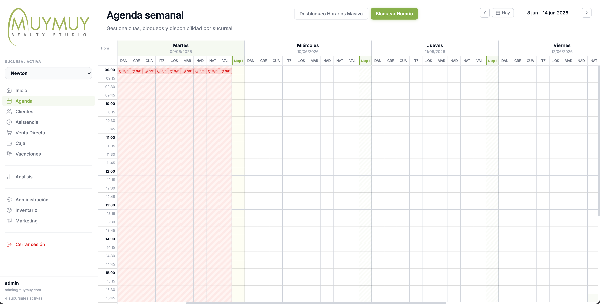
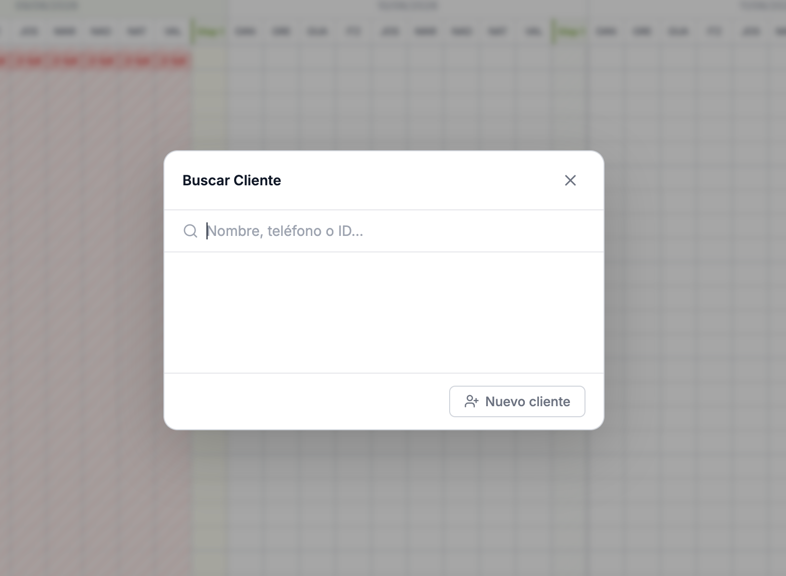
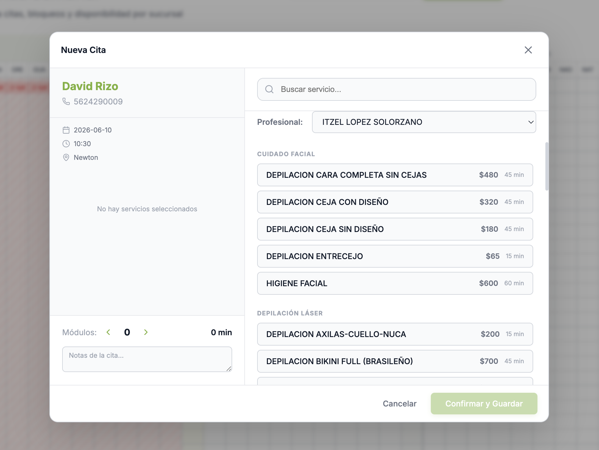
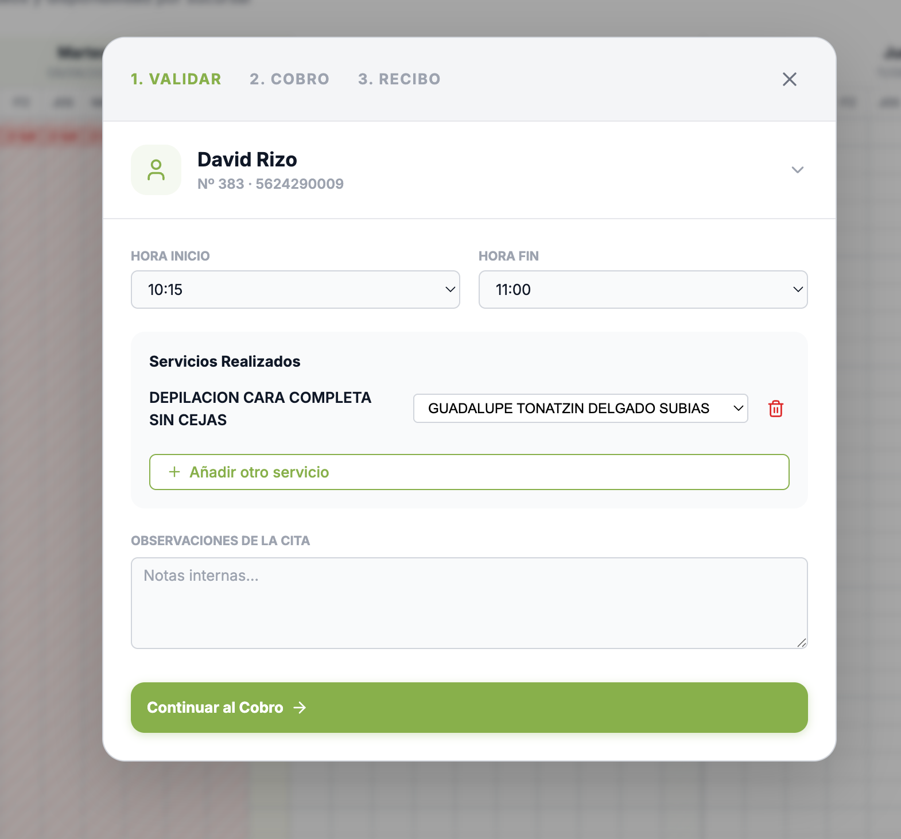
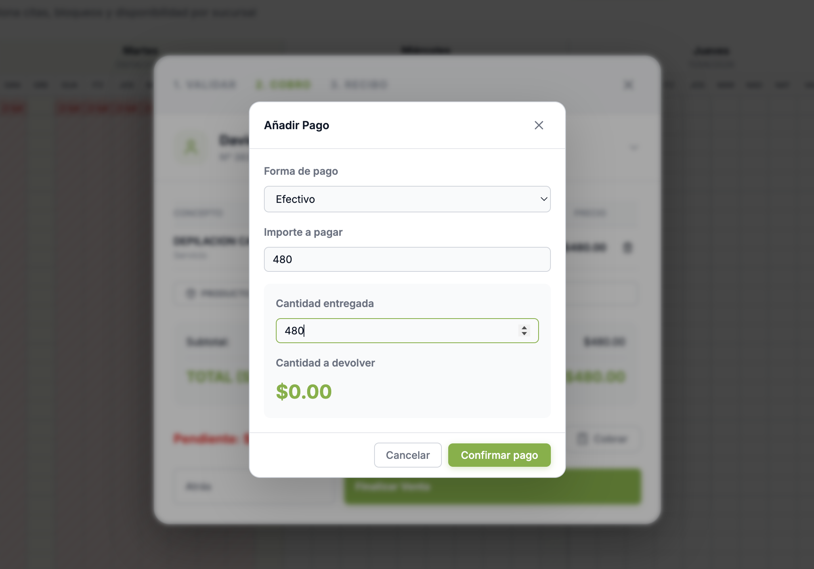
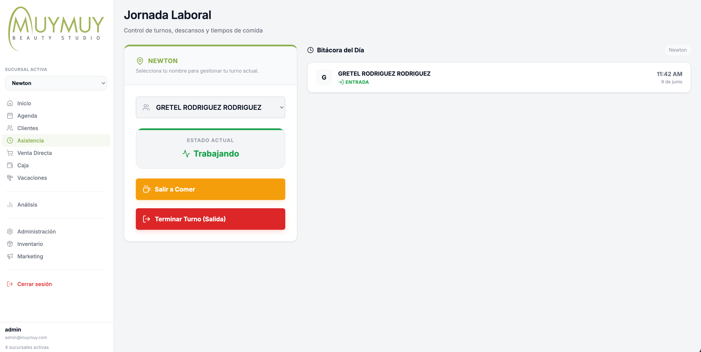
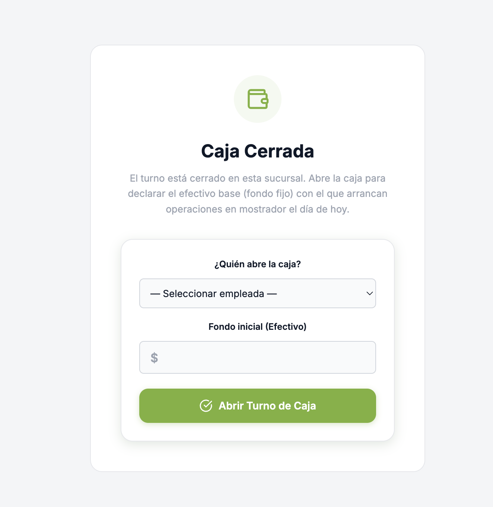
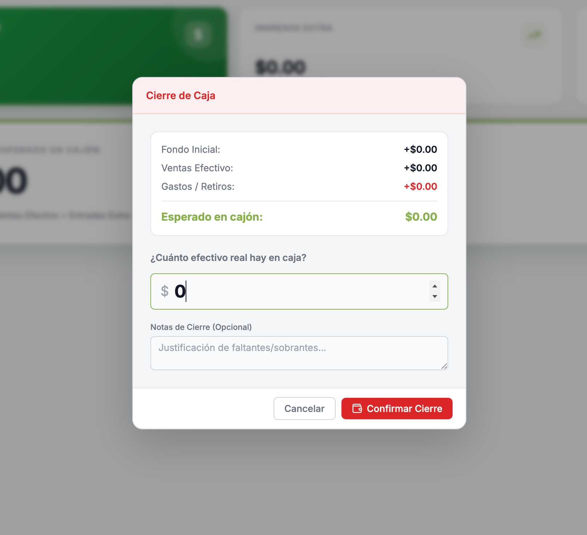
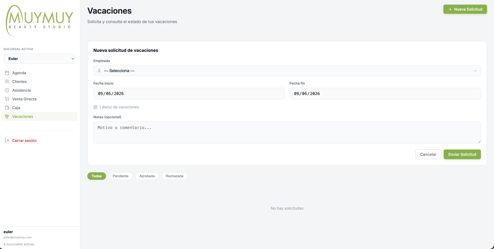

  
  <h1 class="cover-title">Manual de Operación de Sucursal</h1>
  
Rol: Empleado / Recepción y Caja

  
Última actualización: Junio 2026

# Introducción al Sistema

Bienvenida al sistema de gestión de **MUYMUY Beauty Studio**. Este manual práctico te guiará paso a paso en tus tareas diarias para garantizar una operación fluida, un cobro correcto y un control preciso de la asistencia y la caja de tu sucursal.

Como **Empleado**, tu cuenta tiene las siguientes características de seguridad y operación:
- **Restricción de Sucursal:** Tu vista está bloqueada automáticamente a la sucursal a la que estás asignada. No es necesario seleccionar o cambiar de sucursal; el sistema lo gestiona por ti.
- **Acceso Limitado:** Solo verás las pestañas operativas. Las métricas avanzadas y configuraciones globales quedan reservadas para administración.

A continuación, explicamos cada sección tal como aparecen en tu menú lateral:

---

# 1. Agenda

La agenda es la pantalla principal del estudio. En ella visualizarás las citas asignadas a cada profesional divididas por columnas y rangos de 15 minutos.

## 1.1 Agendar una Cita Nueva
Agendar una cita requiere de dos pasos sencillos para asegurar que no se dupliquen clientes y que los datos sean correctos:

### Paso 1: Búsqueda del Cliente
Al hacer clic en cualquier espacio libre de la agenda (debajo de la columna de la profesional y en la hora deseada), se abrirá automáticamente el buscador.
- Escribe el nombre, teléfono o ID del cliente para buscarlo en la base de datos.
- Si el cliente ya existe, haz clic sobre su nombre para pasar al formulario.
- Si es un cliente nuevo, presiona el botón **Nuevo cliente** para registrar sus datos básicos antes de continuar.

### Paso 2: Detalles de la Cita
Una vez seleccionado el cliente, se cargará el formulario de reserva:
- **Servicios:** Selecciona los servicios que solicita el cliente.
- **Hora y Fecha:** Confirma que el horario asignado sea el correcto.
- **Notas:** Añade observaciones importantes si el cliente tiene alguna preferencia.
- Presiona **Crear Cita** para guardarla en la agenda.

## 1.2 Cobro de Citas (Validación)
Las citas se cobran **únicamente** desde la agenda, mediante el proceso de validación.

1. **Validar Servicios:** Cuando un cliente finalice, haz clic en su cita y selecciona **Validar**. Verifica que los servicios cobrados correspondan a lo realizado. Puedes ajustar la hora real de inicio/fin o cambiar la profesional.
   
2. **Checkout de la Cita:** Pasarás a la pantalla de Checkout.
   - Si compró productos extras, presiona **+ Producto**.
   - Si deja propina o aplicas descuento, presiona **+ Propina** o **% Dcto.**.
3. **Registrar el Pago:** Selecciona el **Método de pago** e ingresa el importe entregado por el cliente. Presiona **Confirmar pago**.
   

> [!TIP]
> **¿Cometiste un error al registrar el pago?** Puedes hacer clic en el **icono de la papelera (basura)** al lado del pago agregado para eliminarlo y registrarlo de nuevo antes de cerrar la venta.

---

# 2. Clientes

En esta sección tienes acceso al directorio de clientes que han visitado la sucursal.
- Puedes utilizar la barra de búsqueda superior para encontrar rápidamente a cualquier cliente por nombre, teléfono o correo.
- Selecciona el perfil del cliente para ver su historial de servicios y notas.

---

# 3. Asistencia

Llevar un registro preciso de las horas de entrada y salida es fundamental para el cálculo correcto de tu nómina y puntualidad.

### Cómo registrar tu entrada y salida:
1. Dirígete al panel de **Asistencia** en el menú lateral.
2. Selecciona tu nombre en la lista de profesionales.
3. Presiona el botón **Registrar Entrada** (al inicio del día) o **Registrar Salida** (al finalizar la jornada).

> [!IMPORTANT]
> **Tolerancia y Estatus "Sin Entrada" (S/E):**
> Existe un período de tolerancia de **10 minutos** a partir de la hora de apertura. Si no registras tu entrada a tiempo, aparecerás automáticamente con la etiqueta **"S/E" (Sin Entrada)** en la agenda, lo cual afectará tus métricas de asistencia.

---

# 4. Venta Directa

Si un cliente entra a la sucursal **solo a comprar un producto** (sin tener cita en la agenda), debes usar esta pestaña.

1. Selecciona opcionalmente al cliente en el buscador y la profesional que realizó la venta.
2. Haz clic en **Añadir Producto** y selecciona lo que el cliente va a llevar.
3. Presiona **Añadir pago**, selecciona el método e ingresa el importe.
4. Haz clic en **Cerrar Venta** para imprimir el ticket.

---

# 5. Caja

El control de la sucursal comienza abriendo el turno y finaliza cerrándolo desde esta pestaña.

## Apertura de Caja (Al inicio del día)
Al iniciar el día, debes declarar el efectivo inicial (fondo fijo) que recibes en el cajón de dinero.
1. Selecciona tu nombre en *¿Quién abre la caja?*.
2. Digita el importe exacto del **Fondo inicial (Efectivo)** y presiona **Abrir Turno de Caja**.

## Cierre de Caja (Al final del día)
Al terminar el día de trabajo, debes hacer el corte y declarar el dinero real que dejas en el cajón.
1. Haz clic en **Cerrar Caja**.
2. Cuenta detalladamente el efectivo físico en el cajón y digita el monto en **¿Cuánto efectivo real hay en caja?**.
3. El sistema te mostrará la diferencia en color rojo (si falta) o verde (si sobra). Agrega notas si es necesario y haz clic en **Confirmar Cierre**.

---

# 6. Vacaciones

Desde esta sección puedes solicitar directamente tus días de vacaciones al área de administración y consultar el estado de tus solicitudes.

1. **Nueva Solicitud:** Haz clic en el botón superior para crear una nueva petición. Selecciona tu nombre, la fecha de inicio y la fecha de fin. El sistema calculará automáticamente los días hábiles. Puedes agregar una nota (ej: "Vacaciones de verano") y enviar la solicitud.
2. **Estado de Solicitud:** Tus peticiones aparecerán listadas con una etiqueta de color:
   - Pendiente (En revisión por administración).
   - Aprobada (Tus días ya fueron bloqueados en la agenda).
   - Rechazada (Puedes leer la nota de rechazo del administrador).
3. **Solicitar Extensión:** Si ya tienes una solicitud aprobada y necesitas más días, puedes presionar **"Solicitar extensión"** directamente sobre esa tarjeta.

